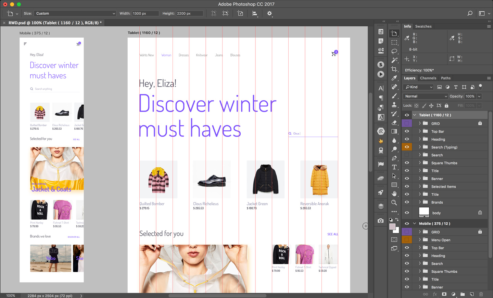

###### DAY20

## 진행 내용

반응형 웹 디자인 최종 실습<i>!</i>

### 반응형 웹 디자인(RWD) 실습

#### 실습 자료 다운로드

[Final__Project/RWD.psd](Final__Project/RWD.psd)

---

## 참고 링크

- [모바일에 최적화된 이벤트 디자인 방법](http://www.ridicorp.com/blog/2017/01/15/mobile-event/)
- [kr.pinterest.com/explore/web-design](https://kr.pinterest.com/explore/web-design/)
- [medium.com/@ux_in_motion](https://medium.com/@ux_in_motion/creating-usability-with-motion-the-ux-in-motion-manifesto-a87a4584ddc)

### 온라인 코드 타이핑 연습 사이트

- [typing.lk](http://typing.lk/)
- [speedcoder.net/lessons](http://www.speedcoder.net/lessons/)
